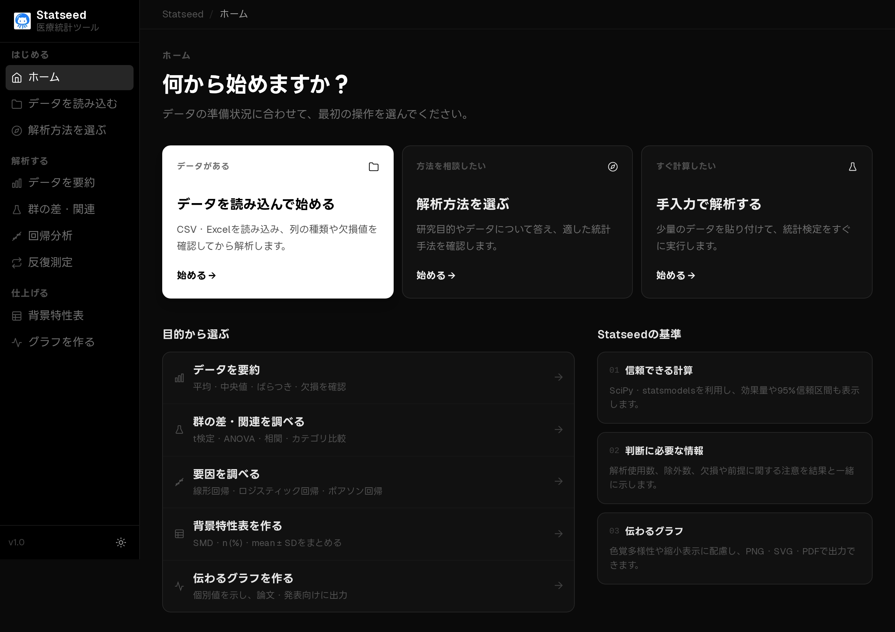
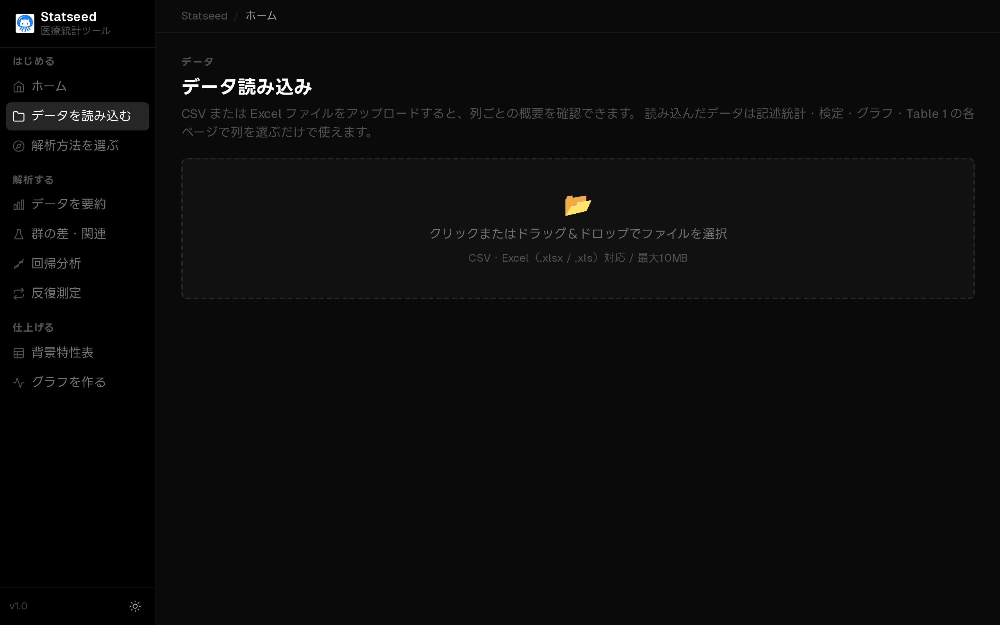
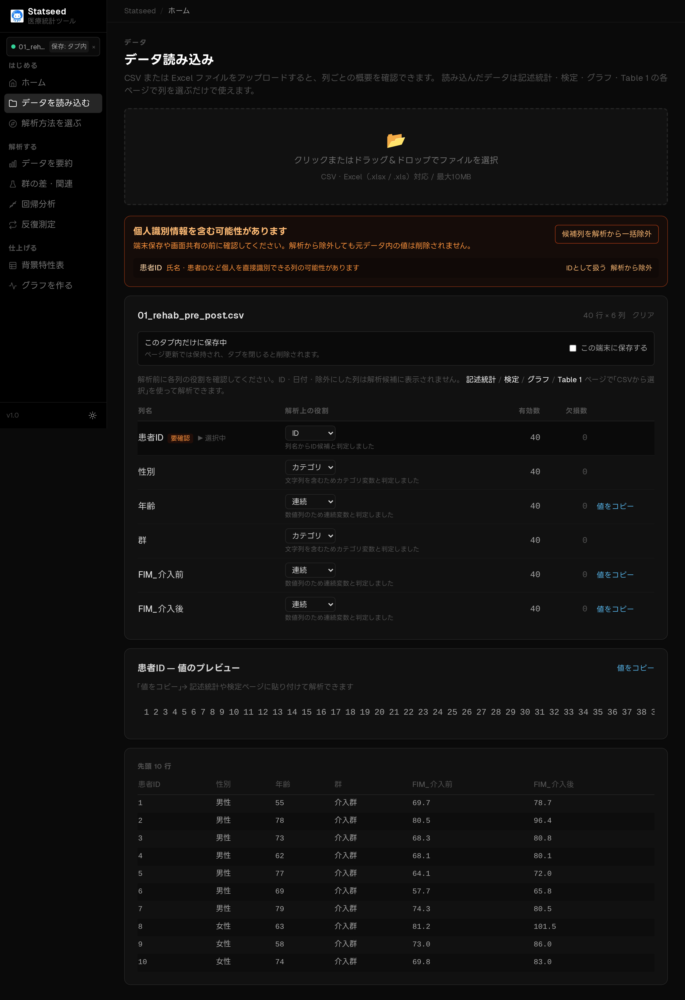
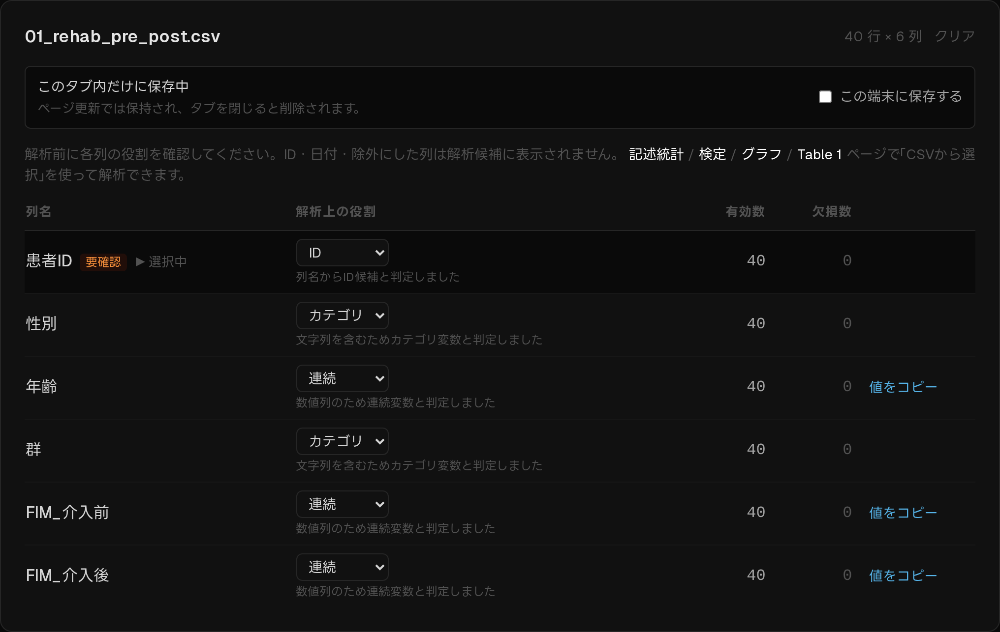
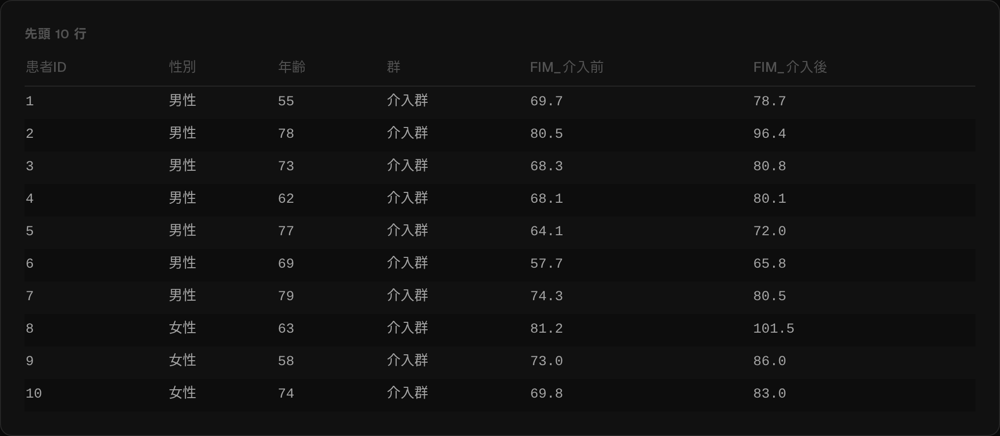

# はじめに — データの読み込みと基本操作

StatSeed は、ブラウザだけで完結する医療統計アプリです。インストール不要・完全日本語で、
論文・学会発表にそのまま使えるグラフまで作成できます。このページでは最初の一歩として、
データの読み込みと画面の見方を説明します。

## 1. ダッシュボード（トップ画面）

ログイン後のトップ画面です。左のサイドバーから「データを読み込む」「解析方法を選ぶ」
「手入力で解析する」のいずれかを選んで作業を始めます。

## 2. データ読み込み画面

「データを読み込む」を開くと、CSV・Excel ファイルのアップロード画面が表示されます。
点線の枠をクリックするか、ファイルをドラッグ＆ドロップします。

> **データはあなたの端末から外に出ません。** 標準ではブラウザのタブ内だけに保持され、
> 明示的に保存を選んだときだけ端末に残ります。

## 3. データプレビューと変数の役割

読み込むと、各列の「役割」（ID / 連続変数 / 順序 / カテゴリ / 日付 / 除外）が自動判定され、
先頭の数行がプレビュー表示されます。判定が違う場合はその場で変更できます。

### 列の役割

連続変数・カテゴリ変数などの役割は、後の検定で選べる変数を左右します。意図と違う場合は
プルダウンで上書きしてください。

### データプレビュー

実際の値が正しく取り込めているか、先頭の数行で確認します。

## 4. 個人情報と欠損のチェック

氏名・患者ID・生年月日などが含まれていそうな列は警告が表示されます。匿名化を確認してください。
各列の欠損数も表示されるので、解析前に把握できます。

## 次のステップ

読み込んだデータは記述統計・検定・回帰・グラフの各ページで「CSVから選択」して使えます。
目的に応じて以下のページへ進んでください。

| 目的 | ページ |
|------|--------|
| 2群の平均を比べる | [Welch の t 検定](./01-welch.md) / [対応のある t 検定](./02-paired-t.md) |
| 分布が偏ったデータで比べる | [Mann–Whitney U](./03-mannwhitney.md) / [Wilcoxon](./04-wilcoxon.md) |
| 割合・人数を比べる | [カイ二乗検定](./05-chisquare.md) / [Fisher 正確検定](./06-fisher.md) |
| 2変数の関連を見る | [Pearson 相関](./07-pearson.md) / [Spearman 相関](./08-spearman.md) |
| 3群以上を比べる | [一元配置 ANOVA](./09-anova.md) |
| 複数要因で予測・調整する | [重回帰分析](./10-regression.md) |
| グラフを仕上げる | [グラフ編集](./11-graph-editing.md) / [出力・エクスポート](./12-export.md) |

---

[マニュアル目次へ →](./README.md)

