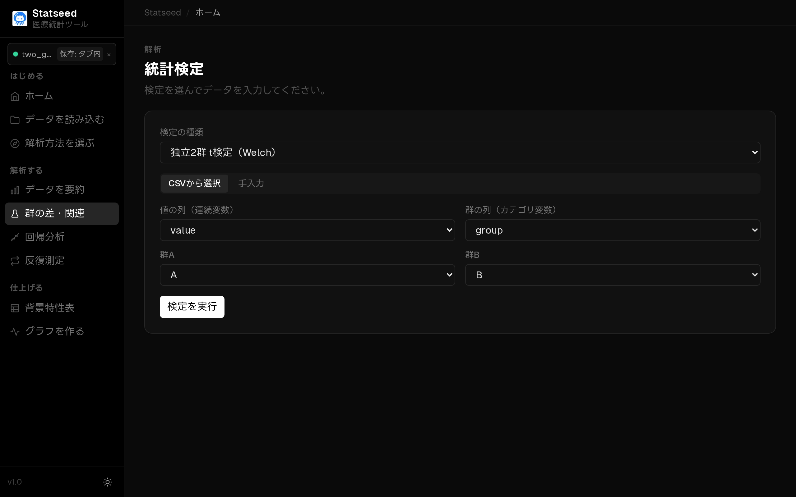
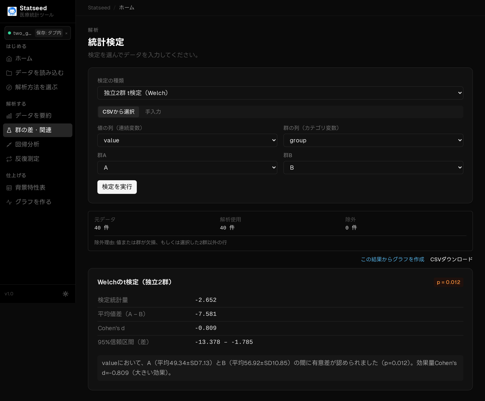

# Welch の t 検定（独立2群の平均の比較）

## この検定はいつ使うか

**別々の2つのグループ**の平均値に差があるかを調べたいときに使います。たとえば介入群と対照群のように、対応のない（別々の対象からなる）2群を比較する基本の検定です。StatSeed は等分散を仮定しない Welch 法を採用しており、群の人数やばらつきが違っても安心して使えます。

**たとえば：** リハビリの新プログラム群（A群）と従来法群（B群）で、退院時の歩行速度の平均に差があるか。

## 操作手順

### 1. データを確認する

CSVを読み込み、解析に使う変数と欠損の状況を確認します。

### 2. 検定と変数を選ぶ

「群の差・関連」ページを開き、「CSVから選択」を選びます。

検定の種類で **t検定（Welch）** を選びます。

値（連続変数）の列に比較したい数値、群の列にグループ分けの列を指定し、比較する2群（A・B）を選びます。

### 3. 解析を実行して結果を見る

「検定を実行」を押すと、統計量・p値・95%信頼区間と、日本語の解釈が表示されます。

## 結果の読み方

**p値 < 0.05** なら「2群の平均に統計的に意味のある差がある」と判断します。あわせて表示される**平均の差と95%信頼区間**を見て、差が臨床的に意味のある大きさかを確認しましょう。信頼区間が0をまたがない場合、p値も有意になります。

## よくあるつまずきポイント

- **対応のあるデータには使えません。** 同じ人の前後比較は[対応のある t 検定](./02-paired-t.md)を使います。
- 極端な外れ値や大きく歪んだ分布では[Mann–Whitney U 検定](./03-mannwhitney.md)を検討します。
- p値だけで判断せず、効果の大きさ（平均差・信頼区間）も必ず確認しましょう。

---

[← マニュアル目次へ戻る](./README.md)

