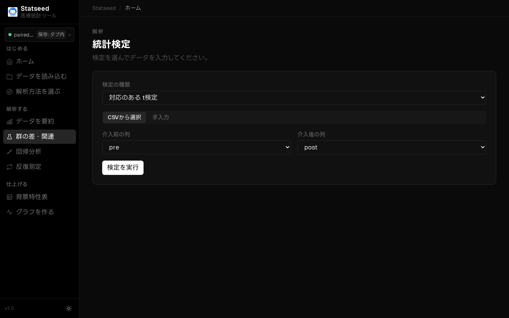
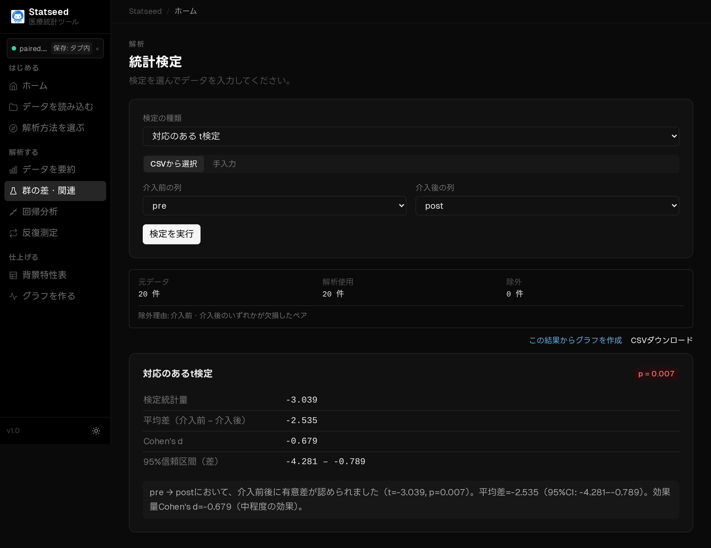

# 対応のある t 検定（前後比較）

## この検定はいつ使うか

**同じ対象**を2回測定し、その変化に意味があるかを調べるときに使います。介入の前後（pre/post）のように、1人につき2つの値がペアになっているデータが対象です。

**たとえば：** 同じ患者20名について、リハビリ介入の前と後で握力に変化があったか。

## 操作手順

### 1. データを確認する

CSVを読み込み、解析に使う変数と欠損の状況を確認します。

### 2. 検定と変数を選ぶ

「群の差・関連」ページで「CSVから選択」を選びます。

検定の種類で **対応のある t 検定** を選びます。

介入前の列（pre）と介入後の列（post）を指定します。ペアは行ごとに対応します。

### 3. 解析を実行して結果を見る

「検定を実行」を押すと、統計量・p値・95%信頼区間と、日本語の解釈が表示されます。

## 結果の読み方

**p値 < 0.05** なら前後の変化に統計的な意味があると判断します。**平均変化量（後 − 前）と95%信頼区間**で、変化の向きと大きさを読み取ります。プラスなら増加、マイナスなら減少です。

## よくあるつまずきポイント

- 前後の行がずれていると正しくペアになりません。同じ人が同じ行に並んでいるか確認しましょう。
- どちらか一方が欠損しているペアは自動的に除外されます。除外数は結果に表示されます。
- 分布が大きく歪む場合は[Wilcoxon 符号順位検定](./04-wilcoxon.md)を使います。

---

[← マニュアル目次へ戻る](./README.md)

