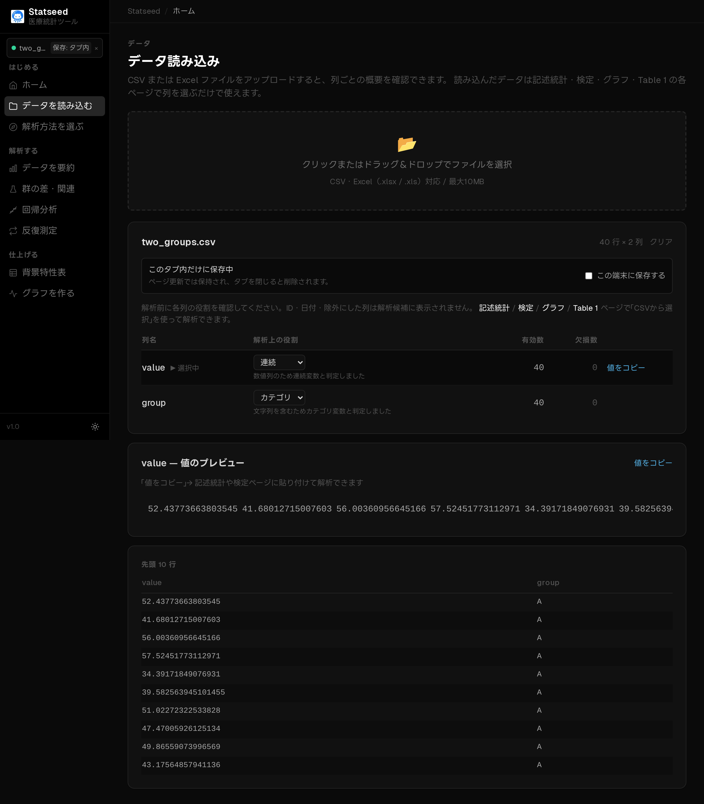
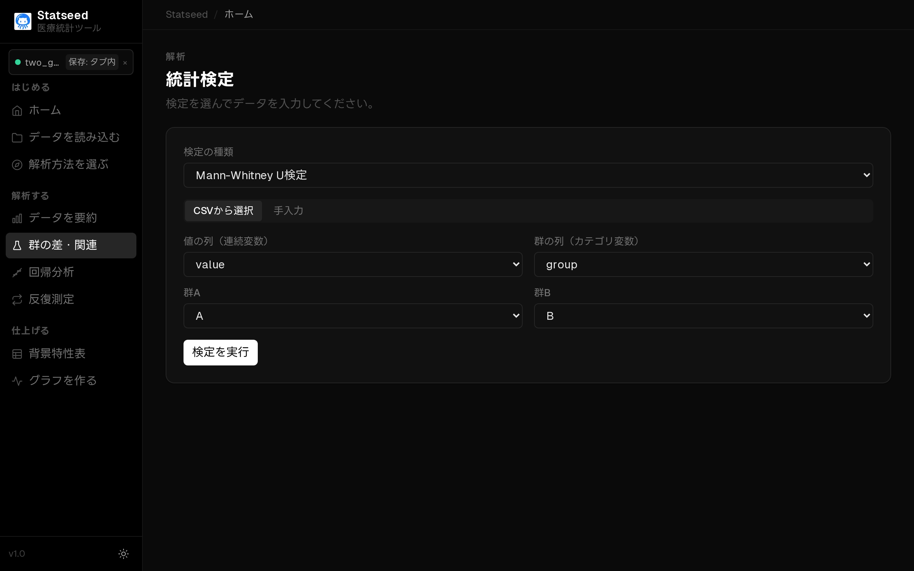
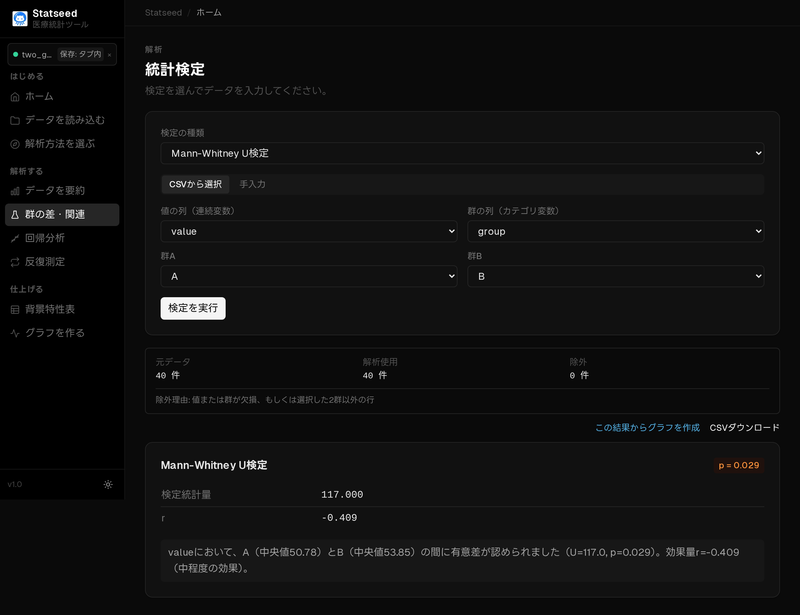

# Mann–Whitney U 検定（順位で2群を比較）

## この検定はいつ使うか

別々の2群を比べたいが、データが**正規分布から外れている・外れ値が大きい・順序尺度**といった理由で平均の比較が向かないときに使います。値そのものではなく順位に基づいて比較するノンパラメトリック検定です。

**たとえば：** 2つの病棟で、患者満足度（5段階評価）の分布に差があるか。

## 操作手順

### 1. データを確認する

CSVを読み込み、解析に使う変数と欠損の状況を確認します。

### 2. 検定と変数を選ぶ

「群の差・関連」ページで「CSVから選択」を選びます。

検定の種類で **Mann–Whitney U 検定** を選びます。

値の列と群の列を指定し、比較する2群（A・B）を選びます。

### 3. 解析を実行して結果を見る

「検定を実行」を押すと、統計量・p値・95%信頼区間と、日本語の解釈が表示されます。

## 結果の読み方

**p値 < 0.05** なら2群の分布（位置）に差があると判断します。平均ではなく「どちらが大きい値を取りやすいか」を見る検定です。

## よくあるつまずきポイント

- 中央値の差を直接検定しているわけではない点に注意（分布の形が大きく違うと解釈に幅が出ます）。
- データが正規分布に近い場合は[Welch の t 検定](./01-welch.md)の方が検出力が高いことがあります。
- 対応のあるデータには使えません（その場合は Wilcoxon）。

---

[← マニュアル目次へ戻る](./README.md)

