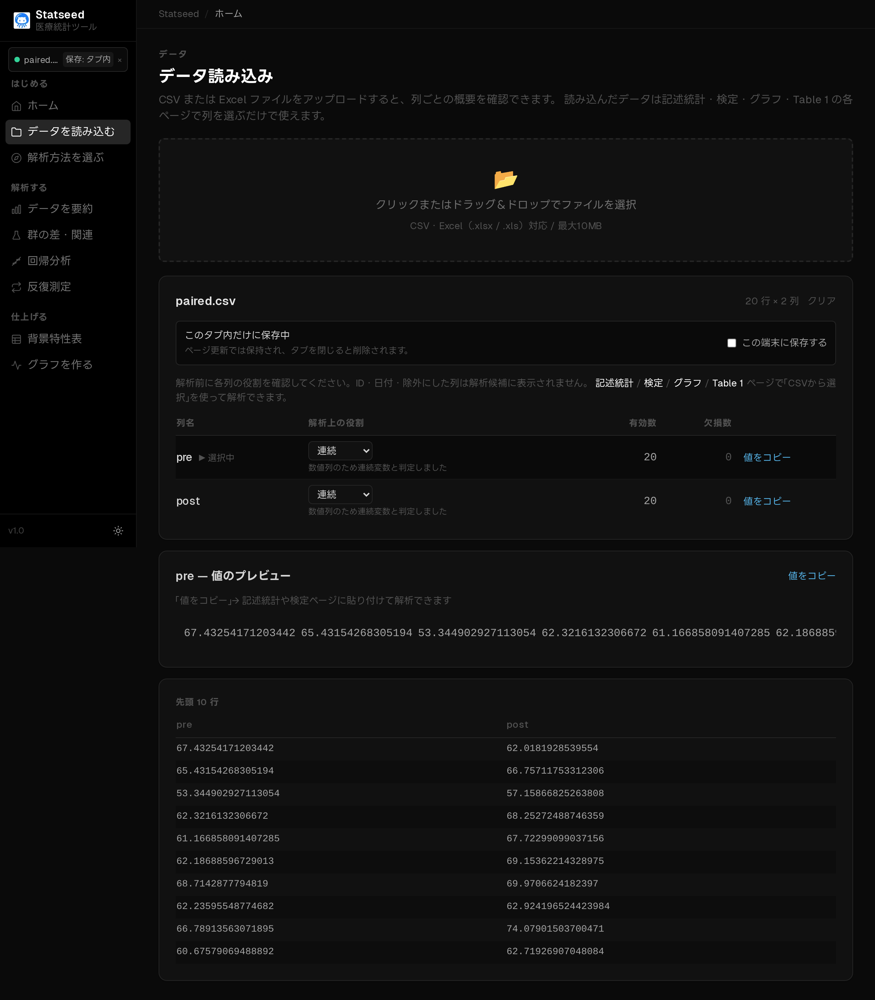
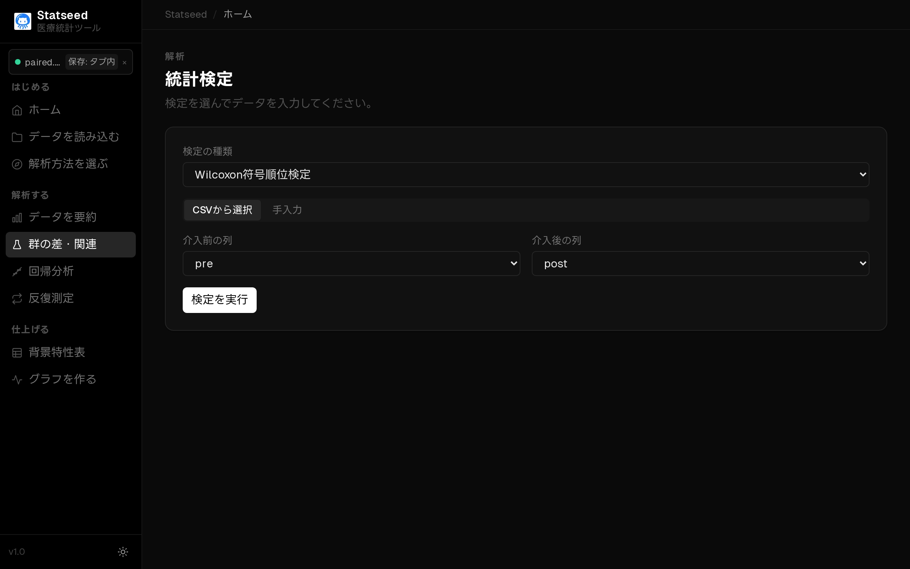
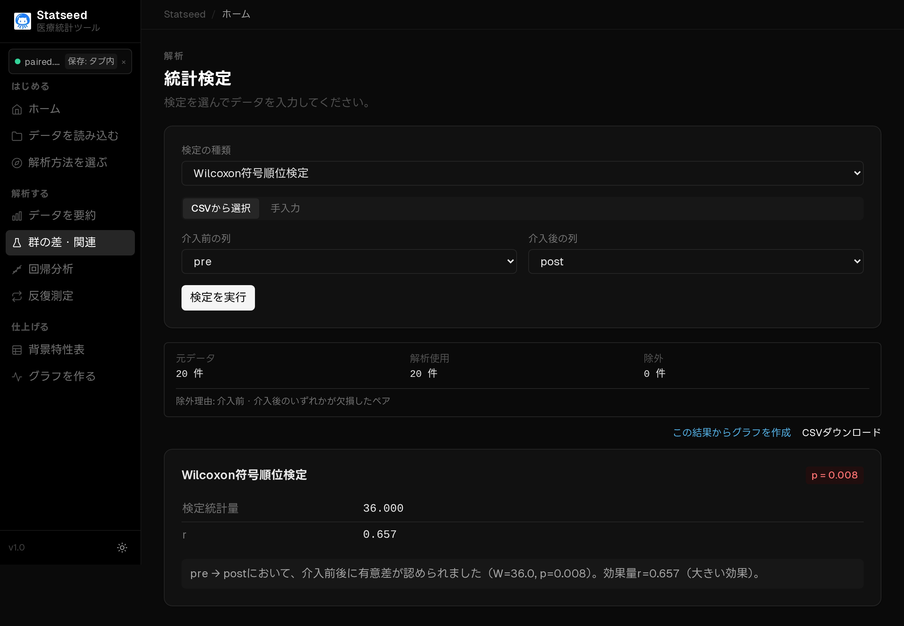

# Wilcoxon 符号順位検定（対応ありをノンパラメトリックに）

## この検定はいつ使うか

同じ対象の前後比較を行いたいが、変化量が正規分布に従わない・外れ値が大きい・順序尺度であるときに使います。対応のある t 検定のノンパラメトリック版です。

**たとえば：** 同じ患者で、介入前後の痛みスコア（VAS）に変化があったか（分布が偏っている）。

## 操作手順

### 1. データを確認する

CSVを読み込み、解析に使う変数と欠損の状況を確認します。

### 2. 検定と変数を選ぶ

「群の差・関連」ページで「CSVから選択」を選びます。

検定の種類で **Wilcoxon 符号順位検定** を選びます。

介入前の列と介入後の列を指定します。

### 3. 解析を実行して結果を見る

「検定を実行」を押すと、統計量・p値・95%信頼区間と、日本語の解釈が表示されます。

## 結果の読み方

**p値 < 0.05** なら前後で分布に差があると判断します。差が0のペア（変化なし）は計算から除かれます。

## よくあるつまずきポイント

- ペアが正しく対応しているか（同じ人が同じ行か）を確認します。
- サンプルサイズが非常に小さいと有意になりにくくなります。
- 変化量が正規分布に近いなら[対応のある t 検定](./02-paired-t.md)を検討します。

---

[← マニュアル目次へ戻る](./README.md)

