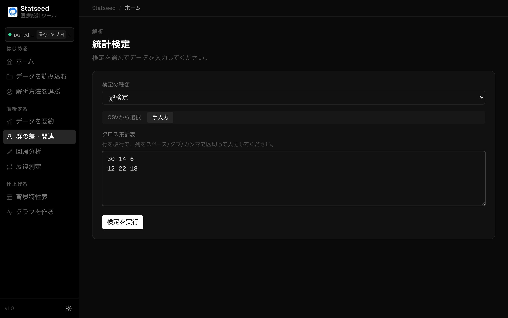
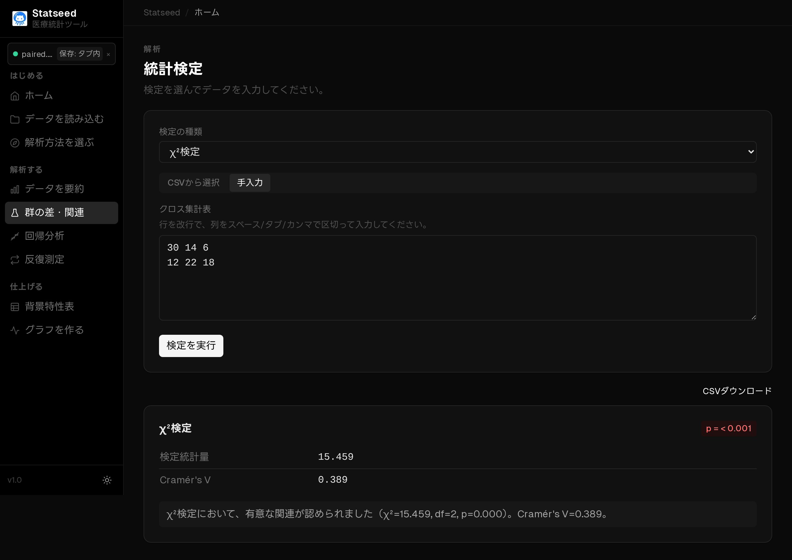

# カイ二乗検定（クロス集計の関連）

## この検定はいつ使うか

2つのカテゴリ変数の間に関連があるか（割合に差があるか）を調べるときに使います。十分なサンプル数があるクロス集計表（分割表）に向いています。StatSeed では2×2表で Yates の連続性補正を行います。

**たとえば：** 性別（男・女）と治療反応（あり・なし）に関連があるか。

## 操作手順

### 1. データを確認する

CSVを読み込み、解析に使う変数と欠損の状況を確認します。

### 2. 検定と変数を選ぶ

「群の差・関連」ページを開きます。クロス集計表は**手入力**で行・列の人数を入力できます。

検定の種類で **カイ二乗検定** を選びます。

クロス集計表に各セルの人数を入力します（行は改行、列はスペース区切り）。

### 3. 解析を実行して結果を見る

「検定を実行」を押すと、統計量・p値・95%信頼区間と、日本語の解釈が表示されます。

## 結果の読み方

**p値 < 0.05** なら2つのカテゴリに関連がある（割合が偏っている）と判断します。期待度数とあわせて、どのセルが多い／少ないかを確認しましょう。

## よくあるつまずきポイント

- **期待度数が5未満のセルが多いときは使えません。** その場合は[Fisher 正確検定](./06-fisher.md)を使います。
- 関連の有無は分かっても「原因→結果」の因果関係は示せません。
- 1つの対象が複数セルに数えられていないか（独立性）を確認します。

---

[← マニュアル目次へ戻る](./README.md)

