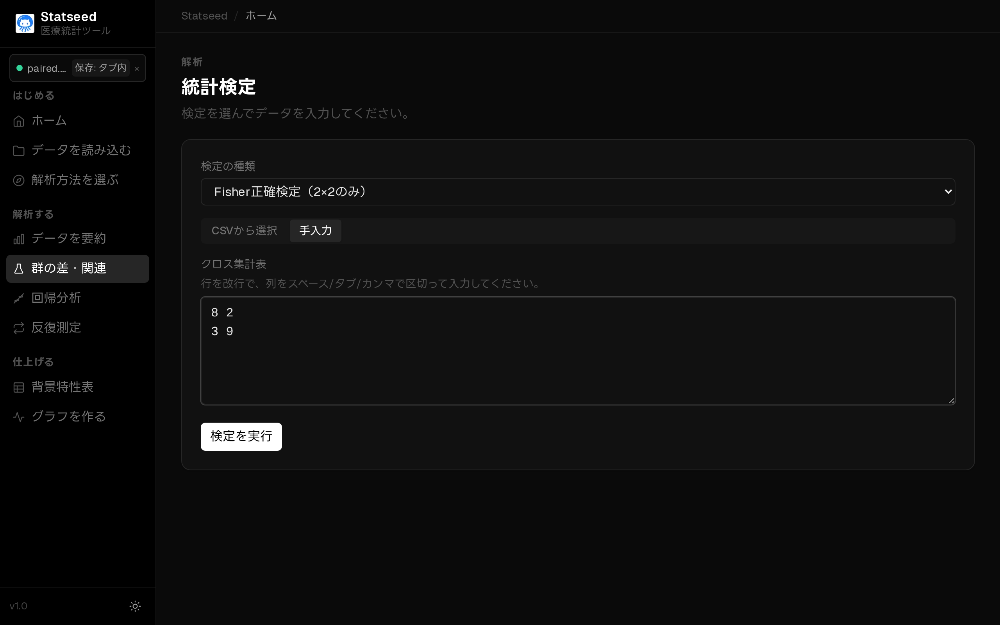
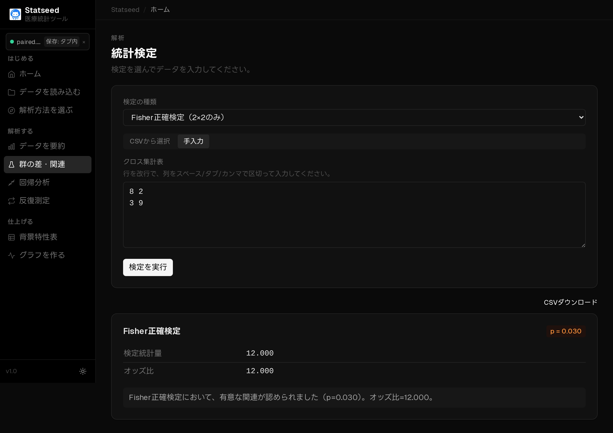

# Fisher 正確検定（少人数のクロス集計）

## この検定はいつ使うか

2×2のクロス集計で、**サンプル数が少なくカイ二乗検定が使えない**ときに使います。期待度数が小さくても正確な確率を計算できます。

**たとえば：** まれな合併症（あり・なし）と、2つの術式の関連を少人数で比べる。

## 操作手順

### 1. データを確認する

CSVを読み込み、解析に使う変数と欠損の状況を確認します。

### 2. 検定と変数を選ぶ

「群の差・関連」ページを開き、クロス集計表を**手入力**します。

検定の種類で **Fisher 正確検定** を選びます。

2×2の各セルの人数を入力します。

### 3. 解析を実行して結果を見る

「検定を実行」を押すと、統計量・p値・95%信頼区間と、日本語の解釈が表示されます。

## 結果の読み方

**p値 < 0.05** なら2群の割合に差があると判断します。少人数でも正確な検定ができますが、検出力は高くないため有意になりにくい点に注意します。

## よくあるつまずきポイント

- サンプルが十分に大きいなら[カイ二乗検定](./05-chisquare.md)でも構いません。
- 0 を含むセルがあっても計算できます。
- やはり因果関係そのものは示せません。

---

[← マニュアル目次へ戻る](./README.md)

