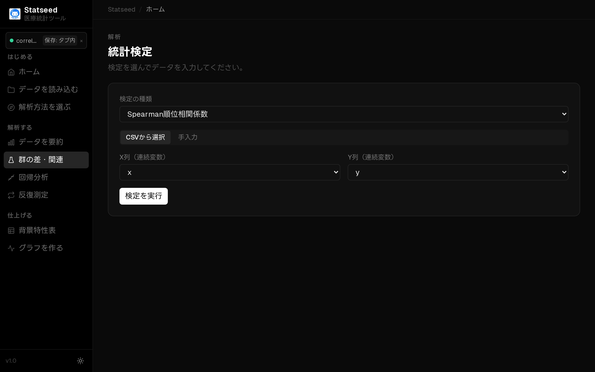
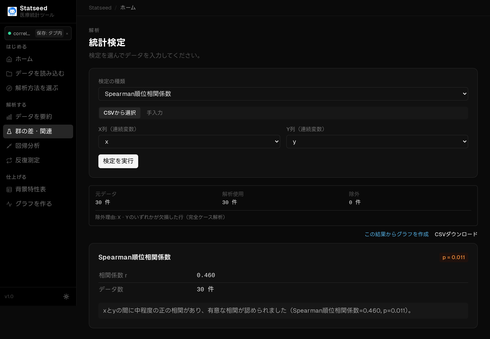

# Spearman 相関（順位による関連）

## この検定はいつ使うか

2変数の関連を見たいが、直線的でない・外れ値が大きい・順序尺度であるときに使います。値を順位に変換して関連を評価するノンパラメトリックな相関です。

**たとえば：** 重症度（順序尺度）と在院日数に関連があるか。

## 操作手順

### 1. データを確認する

CSVを読み込み、解析に使う変数と欠損の状況を確認します。

### 2. 検定と変数を選ぶ

「群の差・関連」ページで「CSVから選択」を選びます。

検定の種類で **Spearman 相関** を選びます。

x の列と y の列を指定します。

### 3. 解析を実行して結果を見る

「検定を実行」を押すと、統計量・p値・95%信頼区間と、日本語の解釈が表示されます。

## 結果の読み方

**ρ（ロー）** が +1/-1に近いほど強い単調関係を表します。直線でなくても「一方が増えれば他方も増える」傾向を捉えられます。

## よくあるつまずきポイント

- 順位に基づくため、外れ値の影響を受けにくいのが利点です。
- 関連が直線的でデータが正規分布に近いなら[Pearson 相関](./07-pearson.md)が向きます。
- 同順位（タイ）が多いと値がやや保守的になります。

---

[← マニュアル目次へ戻る](./README.md)

