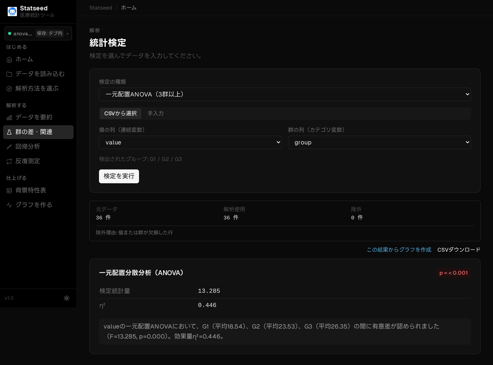

# 一元配置 ANOVA（3群以上の平均の比較）

## この検定はいつ使うか

**3つ以上のグループ**の平均値に差があるかをまとめて調べるときに使います。3群を t 検定で総当たりすると誤って有意と判定しやすくなるため、まず ANOVA で全体差を見ます。

**たとえば：** 3種類のリハビリ法（A・B・C）で、改善度の平均に差があるか。

## 操作手順

### 1. データを確認する

CSVを読み込み、解析に使う変数と欠損の状況を確認します。

### 2. 検定と変数を選ぶ

「群の差・関連」ページで「CSVから選択」を選びます。

検定の種類で **一元配置 ANOVA** を選びます。

値の列と群の列を指定します（群は3水準以上）。

### 3. 解析を実行して結果を見る

「検定を実行」を押すと、統計量・p値・95%信頼区間と、日本語の解釈が表示されます。

## 結果の読み方

**p値 < 0.05** なら「どこかの群間に差がある」と判断します。**どのペアに差があるか**を知るには、多重比較（Tukey HSD など）の事後検定を続けて行います。F値・自由度もあわせて表示されます。

## よくあるつまずきポイント

- ANOVA はあくまで「全体として差があるか」を示すだけで、どの群同士かは事後検定が必要です。
- 分布が大きく歪むときは Kruskal–Wallis 検定（ノンパラメトリック）を使います。
- 群ごとのサンプル数が極端に偏っていないか確認しましょう。

---

[← マニュアル目次へ戻る](./README.md)

