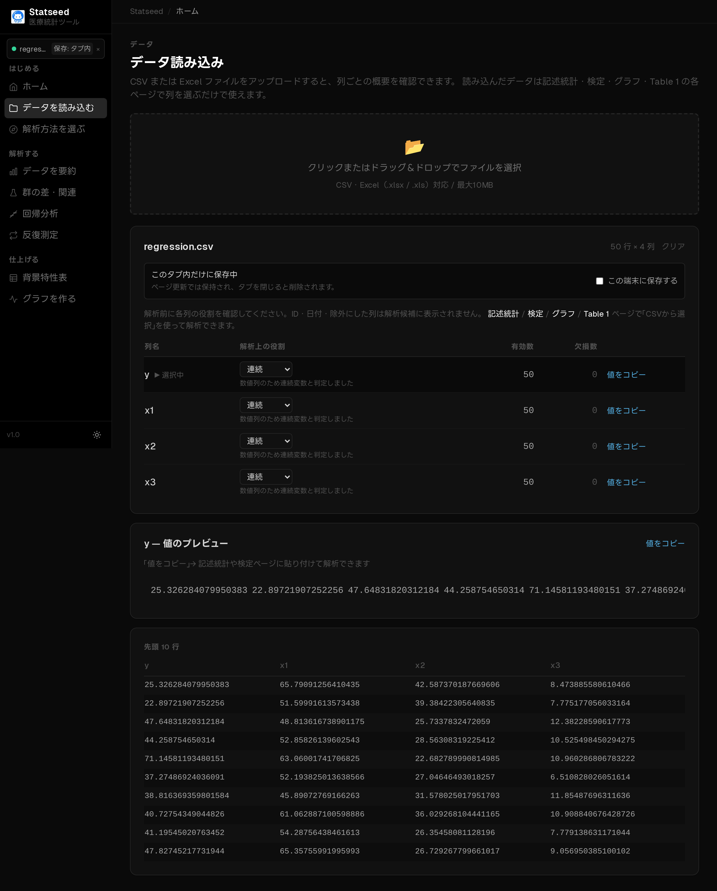
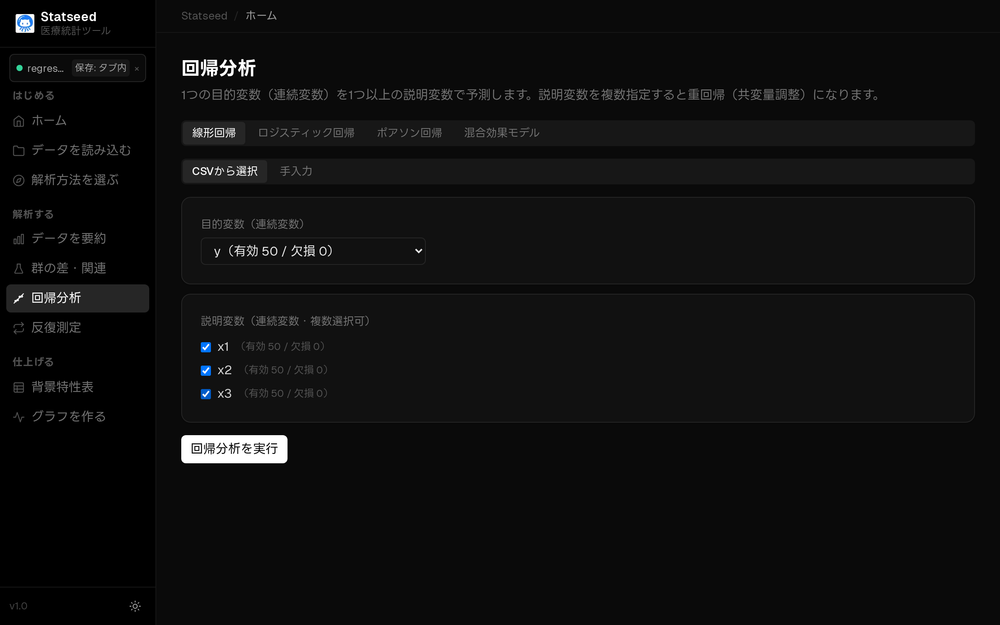
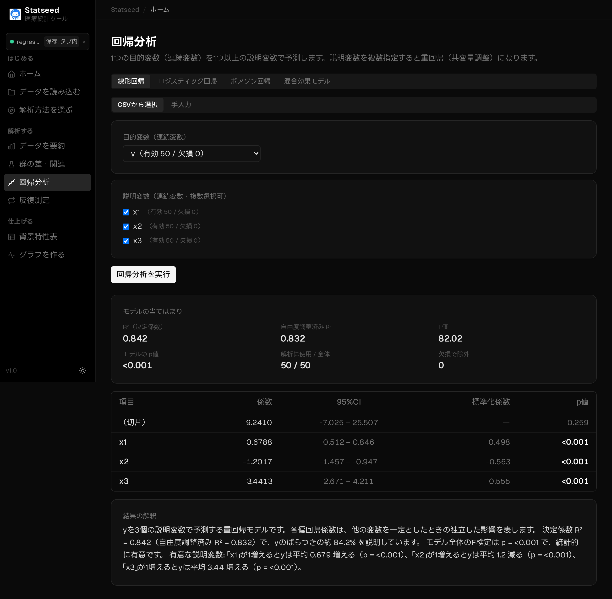

# 重回帰分析（複数の要因で予測・調整する）

## この検定はいつ使うか

1つの連続的なアウトカムに対して、**複数の要因が同時にどう影響するか**を調べるときに使います。交絡因子を調整した「独立した効果」を評価できるのが最大の利点です。

**たとえば：** 歩行速度（アウトカム）を、年齢・握力・BMI で説明・調整したい。

## 操作手順

### 1. データを確認する

CSVを読み込み、解析に使う変数と欠損の状況を確認します。

### 2. 検定と変数を選ぶ

「要因を調べる（回帰分析）」ページで「CSVから選択」を選びます。

回帰の種類で **線形回帰** を選びます。

アウトカム（目的変数）の列を選び、説明変数（共変量）にチェックを入れます。

### 3. 解析を実行して結果を見る

「検定を実行」を押すと、統計量・p値・95%信頼区間と、日本語の解釈が表示されます。

## 結果の読み方

各説明変数の**偏回帰係数と95%信頼区間**を見ます。係数は「他の変数を一定にしたとき、その変数が1増えるとアウトカムがどれだけ変わるか」を表します。**標準化係数**で影響の相対的な強さを比べられ、**R²／調整済みR²**でモデル全体の説明力が分かります。

## よくあるつまずきポイント

- 説明変数同士の相関が強すぎる（多重共線性）と係数が不安定になります。
- サンプル数に対して説明変数が多すぎると過剰適合します（目安: 1変数あたり10例以上）。
- 欠損がある行はリストワイズ除外されます。使用例数を必ず確認しましょう。
- 2値アウトカムはロジスティック回帰、カウントはポアソン回帰を使います。

---

[← マニュアル目次へ戻る](./README.md)

