# グラフ編集 — 論文・スライド品質に仕上げる

StatSeed のグラフは、描画したあとに**タイトル・軸ラベル・軸範囲・凡例**などをその場で編集でき、
変更は画面のグラフと論文用の最終出力（matplotlib 300dpi）の両方に反映されます。配色は色覚多様性に
配慮した Okabe-Ito パレットを採用しています。

## 1. まずはグラフを描画する

「グラフ作成」ページでデータを選び、グラフ種別（箱ひげ図など）を選んで「グラフを描画」を押します。

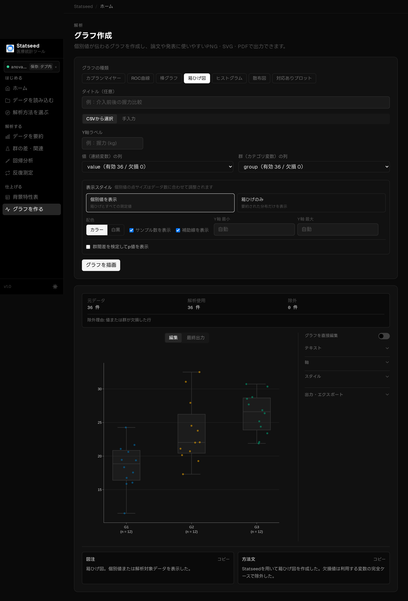

## 2. タイトルを編集する

右サイドバーの「テキスト」セクションでタイトルを入力すると、即座に反映されます。

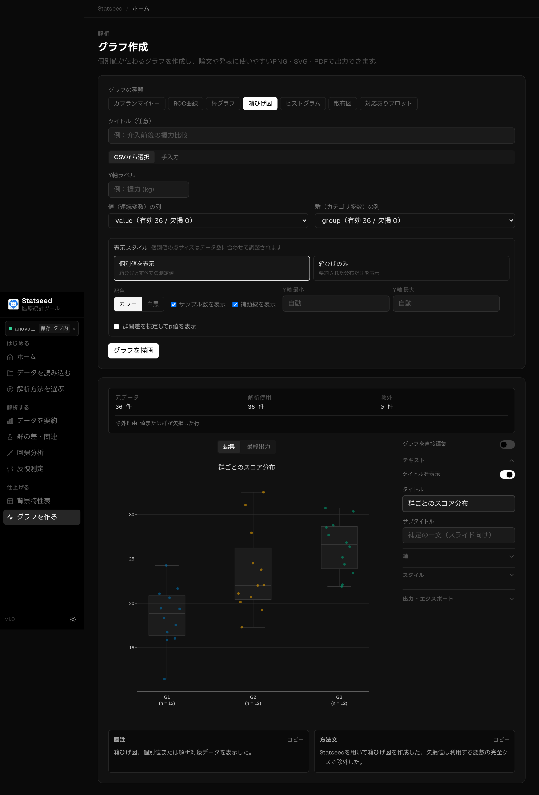

## 3. X軸ラベルを編集する

「軸」セクションで X 軸ラベルを変更します。

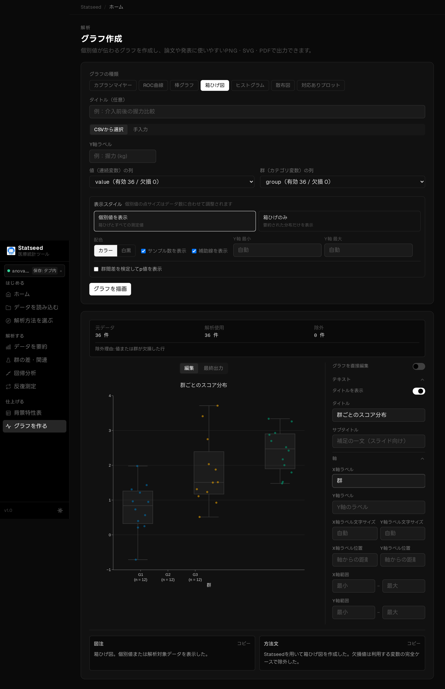

## 4. Y軸ラベルを編集する

同じく Y 軸ラベルを変更します（単位を入れると論文向きです）。

## 5. 軸の範囲を指定する

Y 軸の最小・最大を指定して、見せたい範囲に固定します。複数のグラフで軸をそろえたいときに有効です。

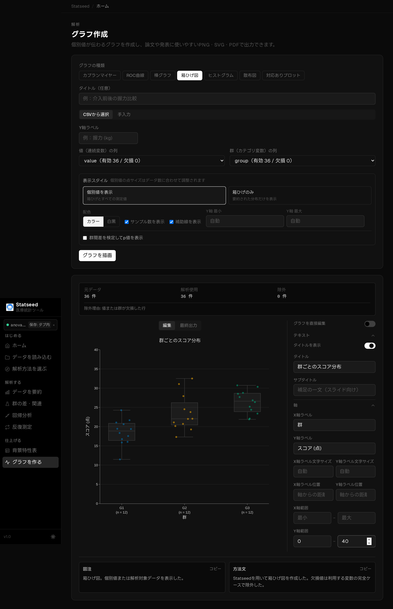

## 6. 凡例の表示／非表示

「スタイル」セクションのトグルで凡例を消したり戻したりできます。

| 非表示 | 表示 |
|--------|------|
|  |  |

## 7. 凡例の位置

凡例は右上・右下・左上・左下から選べます。データに重ならない位置を選びましょう。

| 右上 | 右下 |
|------|------|
| 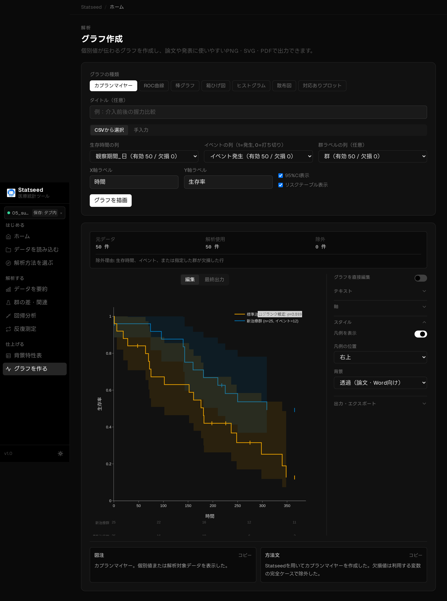 |  |

| 左上 | 左下 |
|------|------|
| 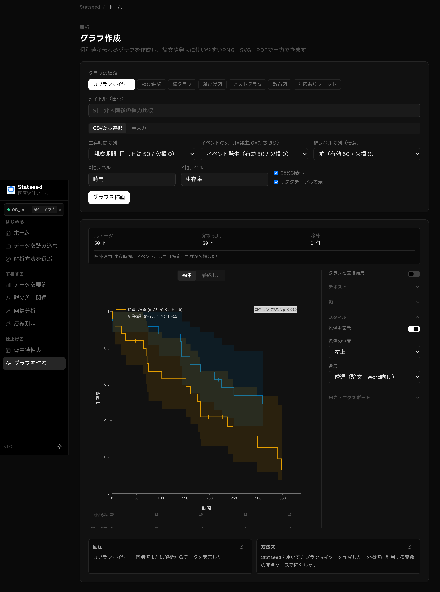 | 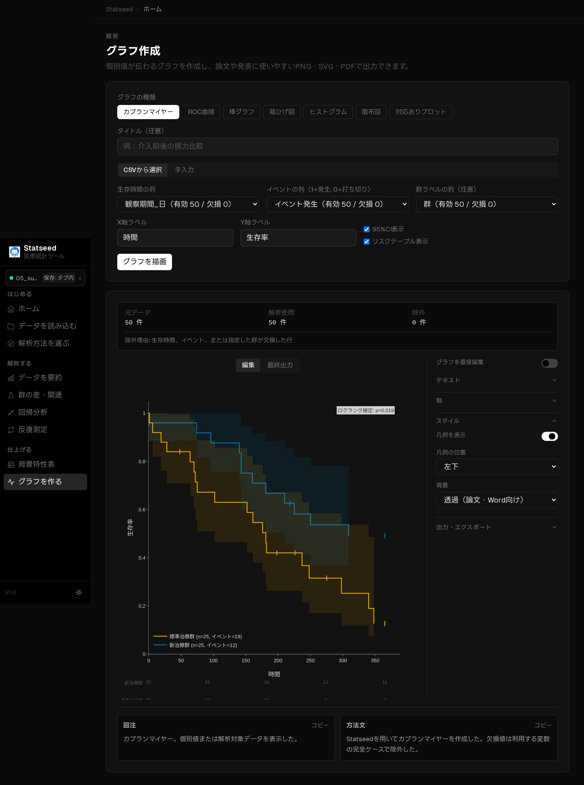 |

## 8. 直接編集モード

「グラフを直接編集」をオンにすると、グラフ上の文字をダブルクリックして直接書き換えたり、
タイトル・凡例をドラッグで移動したりできます。編集結果は出力にも反映されます。

## 9. グラフ種別ごとの仕上がり

StatSeed は用途に応じて多彩なグラフを描けます。

### 箱ひげ図（カラー / 白黒）

外れ値を個別の点で表示し、白黒印刷にも対応します。

| カラー | 白黒（モノクロ印刷向け） |
|--------|--------------------------|
|  | 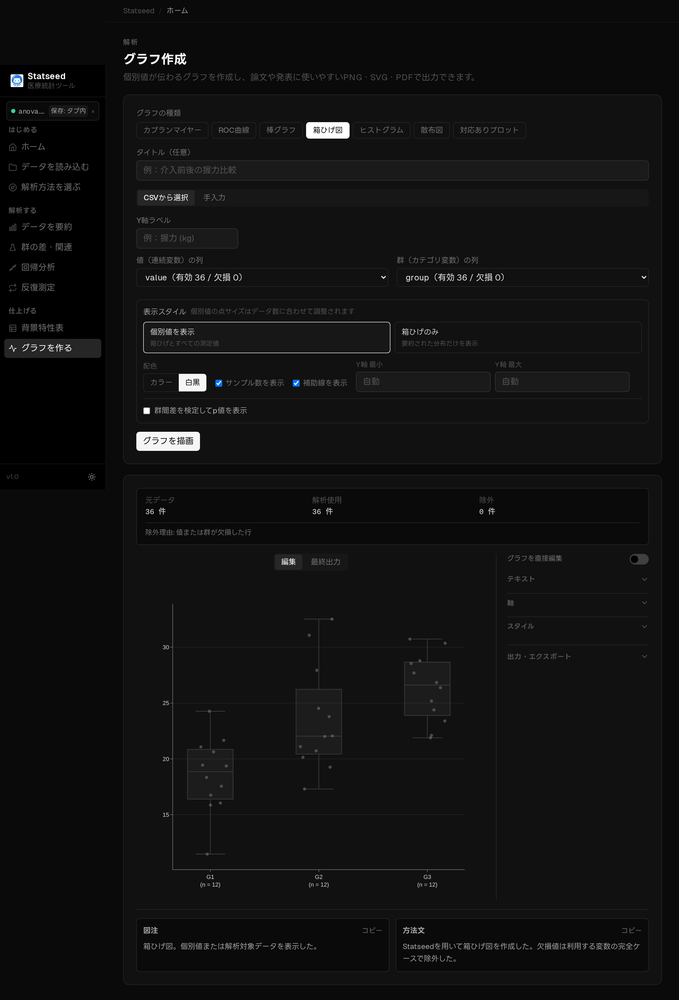 |

### 棒グラフ

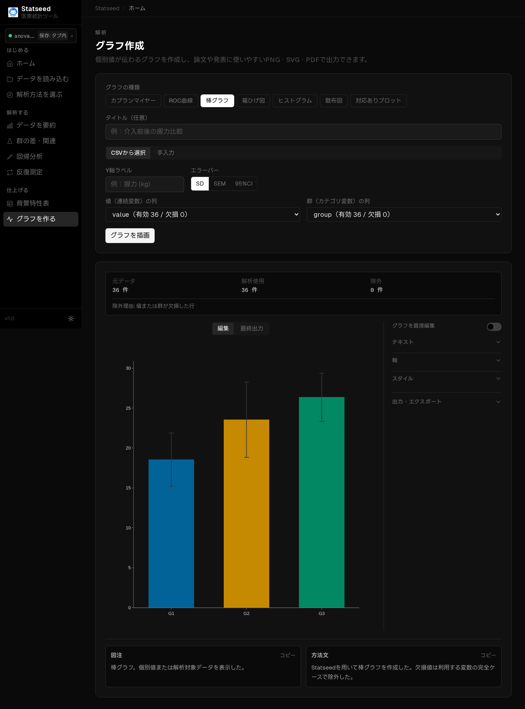

### 散布図

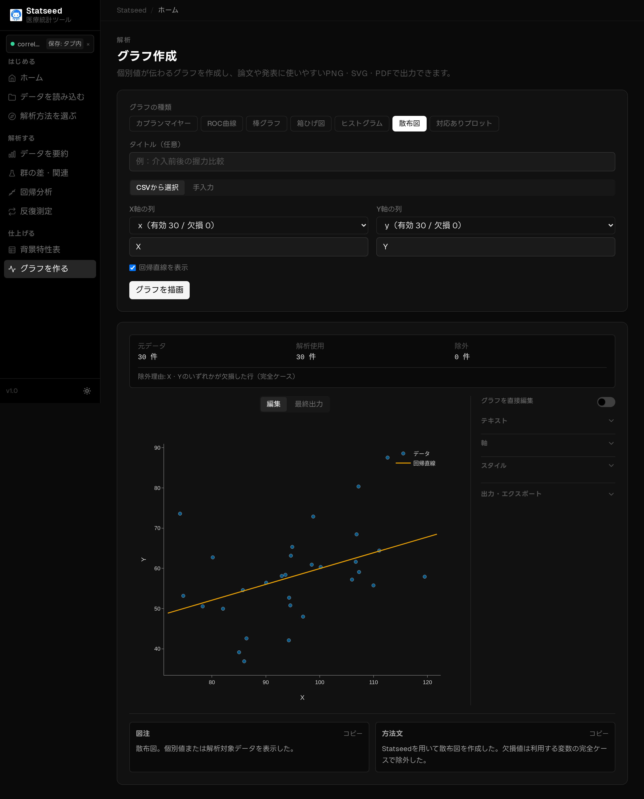

### ヒストグラム

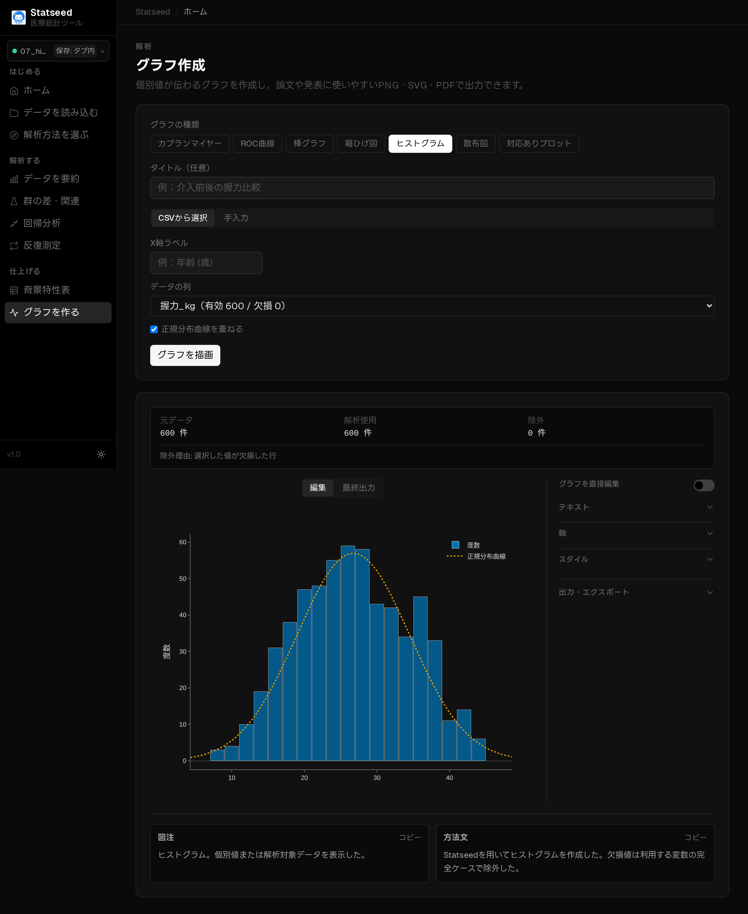

### 対応あり個別値プロット

各対象の前後の値を線で結びます。

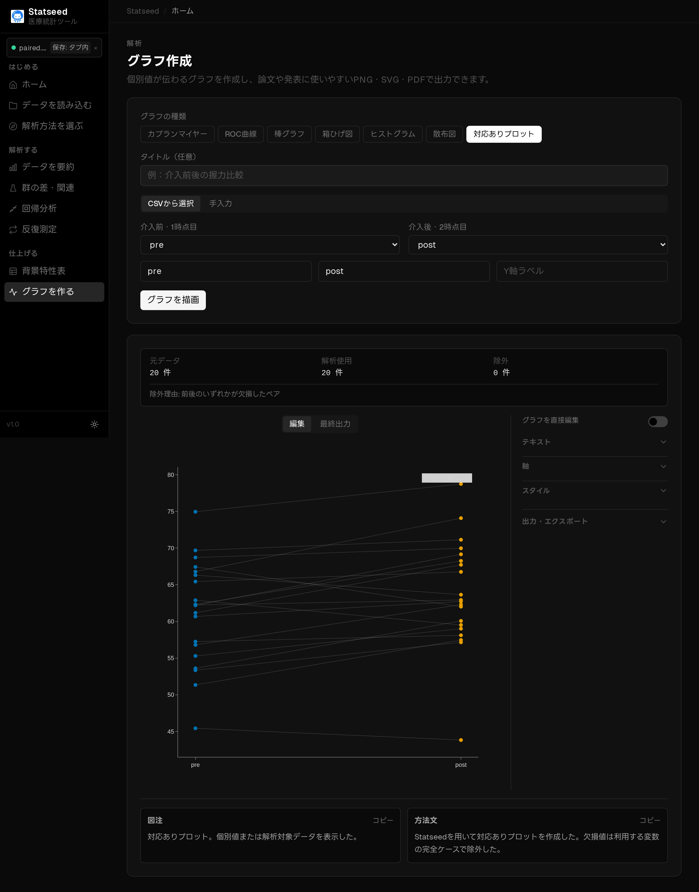

### カプランマイヤー曲線

打ち切りマーク・リスクテーブル・ログランク検定p値を表示します。

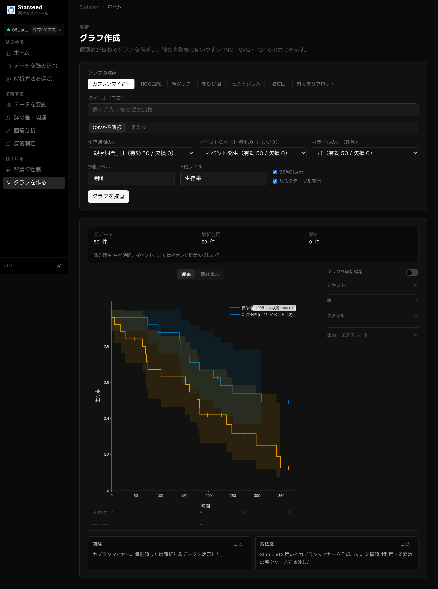

### ROC 曲線

AUC と95%信頼区間、最適カットオフを表示します。

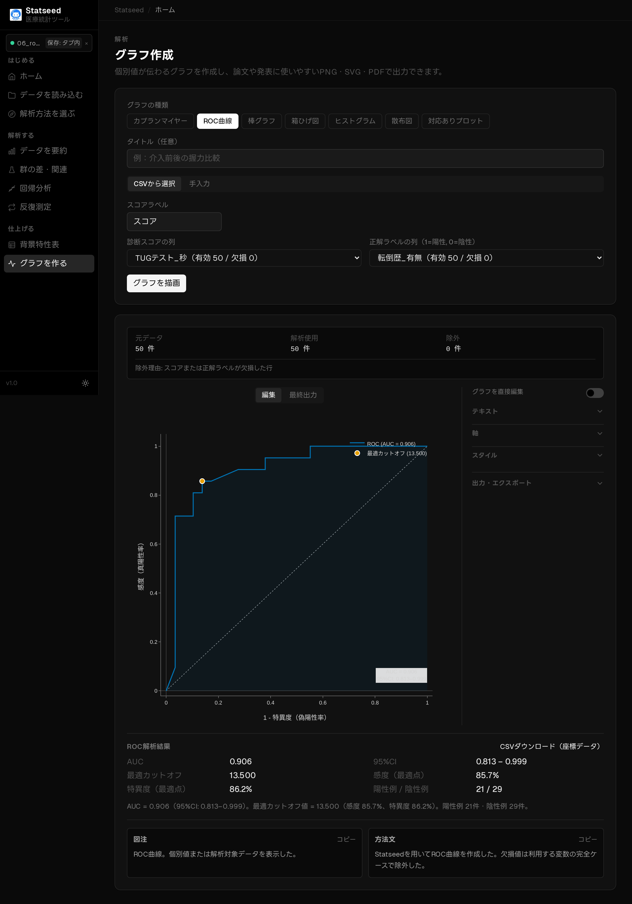

## よくあるつまずきポイント

- 編集セクション（テキスト／軸／スタイル）は初期状態で閉じています。見出しをクリックして開いてください。
- 軸タイトルは Plotly の仕様でドラッグ移動できません。位置はフォームの「軸ラベル位置」で調整します。
- 画面の編集内容は、最終出力（matplotlib）に切り替えると反映されます。詳しくは[出力・エクスポート](./12-export.md)へ。

---

[← マニュアル目次へ戻る](./README.md)

