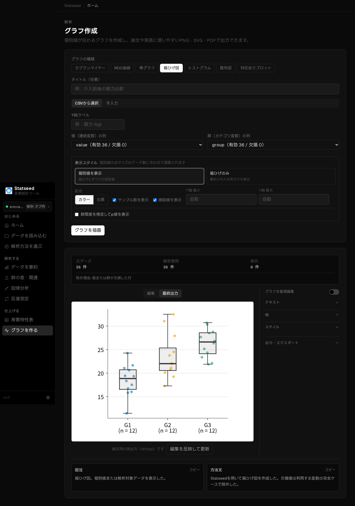
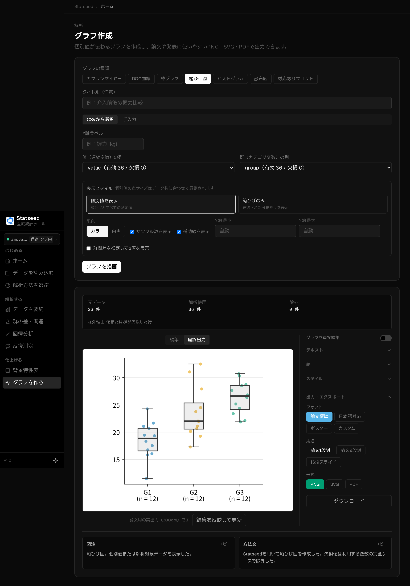
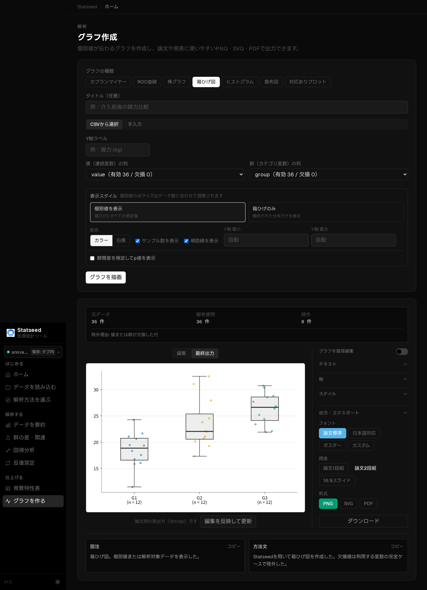
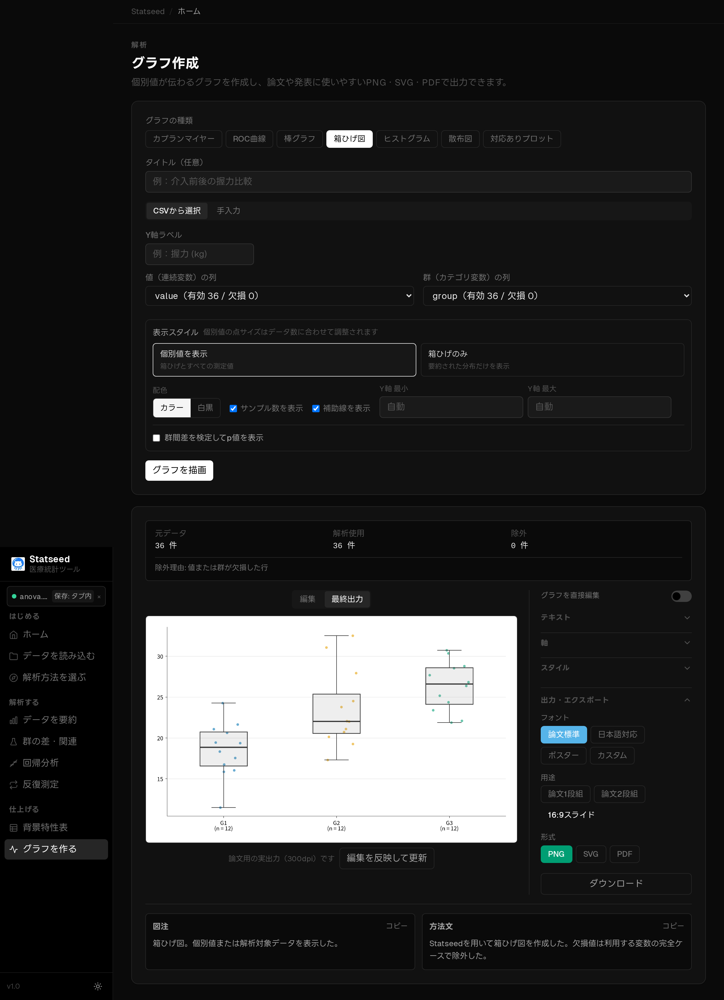
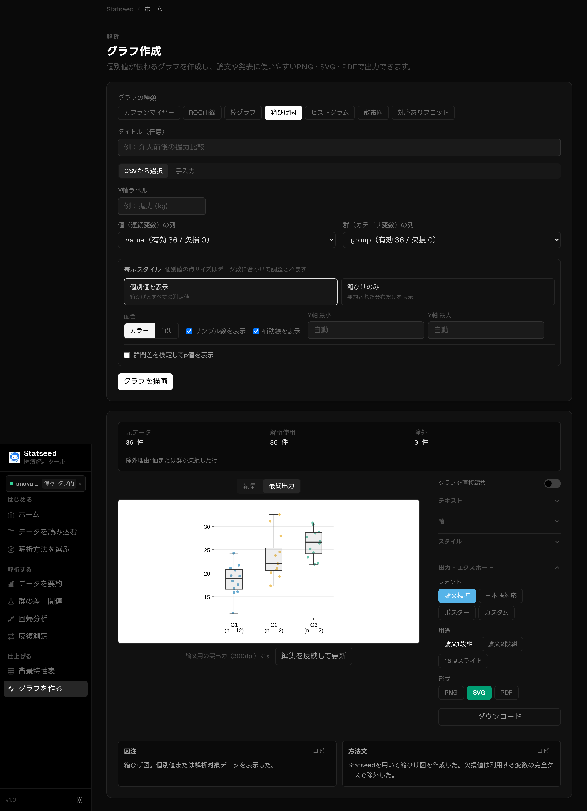
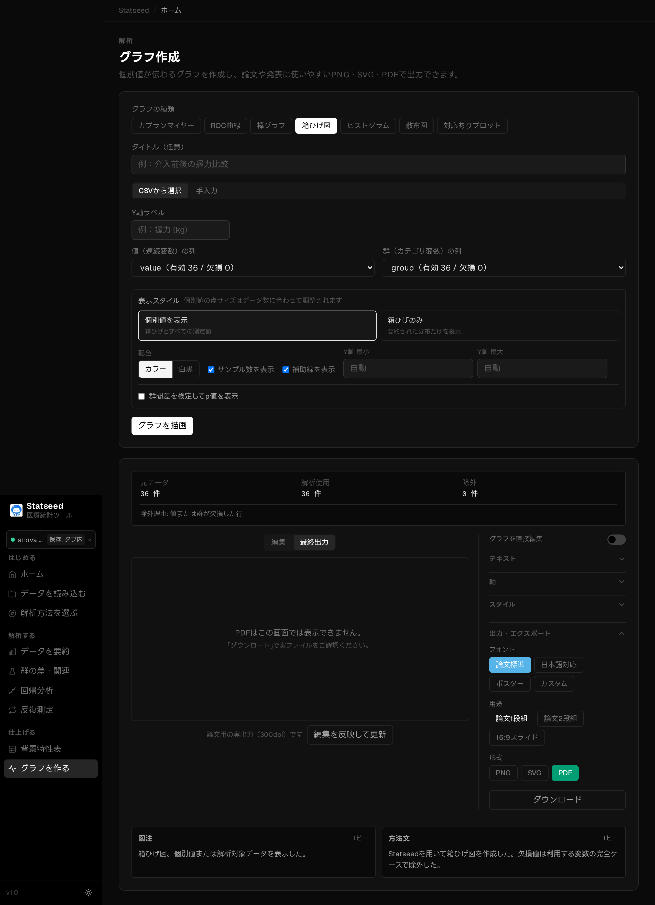

# 出力・エクスポート — 論文・学会発表用に書き出す

仕上げたグラフは、用途に合わせたサイズで PNG / SVG / PDF に書き出せます。あわせて、
**図注（キャプション）と方法文**が自動生成されるので、そのままコピーして原稿に使えます。

## 1. 図注・方法文の自動生成

グラフを描画すると、論文にそのまま使える図注と方法の説明文が自動で作られます。コピーボタンで
クリップボードに取り込めます。

## 2. 最終出力（matplotlib 300dpi）に切り替える

表示モードを「最終出力」にすると、画面表示の Plotly ではなく、論文品質の matplotlib 実画像
（300dpi）のプレビューに切り替わります。

## 3. 出力設定パネル

「出力・エクスポート」セクションを開くと、フォント・用途・形式・ダウンロードをまとめて操作できます。

## 4. 用途プリセット（実寸サイズ）

投稿先や発表形式に合わせた実寸プリセットを選べます。「編集を反映して更新」で再生成されます。

### 論文2段組

### 16:9 スライド

## 5. 出力フォーマット

| 形式 | 用途 |
|------|------|
| **PNG 300dpi** | 学会発表・Word 貼り付け |
| **SVG** | Illustrator で後編集（ベクター） |
| **PDF** | フォント埋め込み・欧文誌投稿標準 |

### SVG 出力

### PDF 出力

PDF はこの画面ではプレビューできませんが、ダウンロードボタンからフォント埋め込み済みの
ファイルを取得できます。

## よくあるつまずきポイント

- 編集した内容が出力に出ないときは「編集を反映して更新」を押してください。
- 日本語ラベルが文字化け・豆腐になる場合は、フォントを「日本語対応」に切り替えます。
- 論文では背景を「透過」、スライドでは「白／クリーム」が見栄えします。
- PDF はプレビュー不可が正常です。ダウンロードして確認してください。

---

[← マニュアル目次へ戻る](./README.md)

